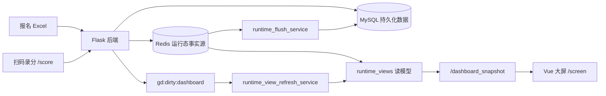

# GuanDan V2.0 掼蛋赛事管理与大屏展示系统

GuanDan V2.0 是一套面向线下掼蛋赛事的管理与现场展示系统，覆盖报名 Excel 导入、队伍等级初始化、三轮对阵生成、轮次与倒计时控制、扫码录分、排名统计和大屏展示。项目当前采用 **Flask 后端 + Vue 3 大屏前端 + MySQL 持久化 + Redis 运行态缓存/异步刷新** 的架构，适合会议、团建、毕业趴等现场赛事快速组织和实时展示。

当前版本已经完成多轮运行态修缮：Redis 作为比赛现场运行态事实源，MySQL 作为持久化落库目标；录分后通过 dirty 标记和后台 worker 异步刷新大屏快照，前端则用本地倒计时和榜单轮播降低网络抖动对现场画面的影响。

## 核心能力

- **报名导入**：读取 `.xlsx` 报名表，初始化办公室、小队、成员、等级和三轮成绩基础数据。
- **自动对阵**：生成默认三轮对阵，尽量满足每轮每队只出现一次、同办公室不互打、减少重复对阵并兼顾等级组合。
- **后台管理**：提供导入报名、清空业务数据、生成对阵、设置当前轮次、启动/暂停倒计时、查看队伍与对阵列表等能力。
- **扫码录分**：根据当前轮次和桌号进入录分页，录入双方最终级数；同级时要求选择最后一局赢家以判定大分。
- **成绩重置与改分**：后台模式可重置指定桌两队得分，旧 Flask 模板录分入口也保留重置能力。
- **大屏展示**：展示当前轮次、倒计时、桌位对阵、小队得分、办公室排名、累计排名、二维码入口和座位图。
- **运行态优化**：Redis 保存当前轮次、倒计时、对阵、比分、读模型和 dirty 状态；写分链路避免同步重建全部快照。
- **辅助工具**：提供报名等级自动填充脚本，可根据上一届最终排名为新报名表生成 A/B/C 小队等级。

## 系统架构



运行时的核心原则：

- Redis 是现场比赛运行态事实源，前端大屏和后台运行态接口优先读取 Redis 读模型。
- MySQL 保存报名、对阵和成绩等业务数据，用于初始化、恢复和持久化。
- 写分后先更新 Redis 并记录 dirty turn，再由后台刷新 worker 重建受影响的大屏和后台读模型。
- 前端收到快照后，本地维护倒计时和小队榜单轮播，减少公网、frp 或局域网抖动造成的画面停顿。

## 目录结构

```text
.
├── GuanDan_backend-V2.0/            # Flask 后端、业务服务、模板页和 unittest
│   ├── api/                         # 前端展示、后台管理、录分 JSON API
│   ├── app/                         # 配置与应用基础模块
│   ├── services/                    # 导入、对阵、录分、Redis runtime、统计和 worker
│   ├── templates/                   # 保留的 Flask/Jinja2 管理和录分页
│   ├── tests/                       # 不依赖真实数据库的 unittest 测试
│   ├── fill_registration_levels.py  # 报名表等级自动填充 CLI
│   ├── Dockerfile
│   └── requirements.txt
├── GuanDanFront-V2.0/               # Vue 3 + Vite 前端大屏与录分页面
│   ├── src/api.js                   # 请求封装和超时控制
│   ├── src/composables/             # 大屏数据轮询、动态分组等组合逻辑
│   ├── src/components/              # 计时、桌位、排行榜、二维码、座位图等组件
│   ├── src/views/                   # /screen、/admin、/score 等页面
│   └── src/utils/rankingRotation.js # 小队榜单轮播工具
├── docs/                            # 计划、交接、性能诊断与后续 issue 草案
├── doc_render_check/                # 项目功能说明 PDF 渲染检查产物
├── AGENTS.md                        # Codex/自动化代理协作规则
└── README.md                        # 当前项目总览
```

## 运行环境

后端默认配置来自 `GuanDan_backend-V2.0/app/config.py`，可通过环境变量覆盖：

| 配置项 | 默认值 | 说明 |
| --- | --- | --- |
| `APP_HOST` | `0.0.0.0` | Flask 监听地址 |
| `APP_PORT` | `5000` | Flask 监听端口 |
| `APP_DEBUG` | `true` | 开发调试模式 |
| `DB_HOST` / `DB_PORT` | `127.0.0.1` / `3306` | MySQL 地址 |
| `DB_NAME` | `guan_egg_game` | 业务数据库 |
| `REDIS_HOST` / `REDIS_PORT` | `127.0.0.1` / `6379` | Redis 地址 |
| `REDIS_TIMEOUT_SECONDS` | `0.5` | Redis 连接超时 |

前端 `.env` 控制 API 地址：

```env
VITE_BASE_API=http://localhost
VITE_BASE_PORT=5000
```

当前仓库中的 `.env` 可能按现场访问地址配置，部署或本地调试前请按实际后端地址调整。

## 本地启动

### 后端

```powershell
cd GuanDan_backend-V2.0
conda activate flask_app_env
python run.py
```

后端启动后默认监听 `http://localhost:5000`，并会启动 Redis 写回 worker 和大屏读模型刷新 worker。

### 前端

```powershell
cd GuanDanFront-V2.0
npm install
npm run dev
```

Vite 开发服务器默认监听 `0.0.0.0:5001`。前端主要页面：

- `/screen`：现场大屏
- `/admin`：前端后台管理页
- `/score`：扫码录分入口
- `/seat`：座位图展示

## 常用验证

后端聚焦测试：

```powershell
cd GuanDan_backend-V2.0
conda run -n flask_app_env python -m unittest tests.test_runtime_store tests.test_runtime_views tests.test_admin_workflow tests.test_admin_score_api tests.test_runtime_api_integration tests.test_runtime_view_refresh_service tests.test_registration_leveling -v
```

前端构建：

```powershell
cd GuanDanFront-V2.0
npm run build
```

小队榜单轮播工具检查：

```powershell
cd GuanDanFront-V2.0
node --input-type=module -e "import { sliceRotatingPage } from './src/utils/rankingRotation.js'; const rows = Array.from({length: 13}, (_, i) => i + 1); const page = sliceRotatingPage(rows, 8, 5000, 5000); if (JSON.stringify(page) !== JSON.stringify([9,10,11,12,13])) process.exit(1);"
```

## 报名等级自动填充

可根据上一届最终排名，为新报名表自动填写 A/B/C 等级：

```powershell
cd GuanDan_backend-V2.0
conda run -n flask_app_env python fill_registration_levels.py `
  --registration uploads/2026-GuanDan-list.xlsx `
  --ranking uploads/第四届中秋掼蛋最终排名表.xlsx
```

默认不会覆盖原报名表，会在同目录生成 `*-已填等级.xlsx`。如确需覆盖，可显式传入 `--in-place`。

## 部署提示

- 后端可用仓库内 `GuanDan_backend-V2.0/Dockerfile` 构建镜像，但生产环境仍建议配合真实 WSGI 服务、反向代理、MySQL 和 Redis 服务管理。
- 前端生产环境应使用 `npm run build` 生成静态资源，再由 Nginx 或其他静态服务托管；不要把 `vite dev` 当作生产服务。
- 现场公网访问或 frp 转发时，重点关注 `/dashboard_snapshot`、`/api/admin/scores` 和 Redis dirty refresh worker 的链路延迟。

## 当前状态与后续计划

已完成的主要优化：

- Redis runtime 事实源迁移与运行态读模型。
- 管理页队伍/对阵展示、轮次过滤、倒计时启动和录分重置修复。
- 写分链路瘦身：写分后标记 `gd:dirty:dashboard`，由后台 worker 异步刷新大屏快照。
- 大屏本地倒计时和榜单轮播，降低外部访问短暂卡顿对现场显示的影响。
- 第五届赛事视觉资产、二维码、座位图和移动端布局适配。
- 项目功能说明文档、渲染检查材料和后续 issue 草案。

后续建议优先处理：

1. SQL 查询、索引和旧 MySQL 高频查询路径审计。
2. 异地主机写分后前端必须 F5 才刷新的链路诊断，区分 frp、网络和代码刷新机制问题。
3. 生产部署方式规范化，包括静态前端托管、WSGI 后端、Redis/MySQL 服务健康检查和日志留存。

更具体的后续迭代计划见：

- `docs/issues/2026-05-25-follow-up-iteration-plan.md`
- `docs/superpowers/2026-05-15-performance-handoff.md`
- `docs/superpowers/2026-05-16-redis-runtime-verification.md`

## 协作注意事项

- 项目说明、计划、交接和评审文档默认使用中文，命令、接口名和路径保持原始标识。
- 不要提交 `__pycache__`、运行日志、临时上传文件、`node_modules`、`dist` 等生成物。
- 不要批量删除文件或目录；如需删除，只能一次删除一个明确文件路径。
- Redis runtime 是当前运行态边界，后续排查不要无意恢复高频 MySQL 读取作为现场显示来源。
